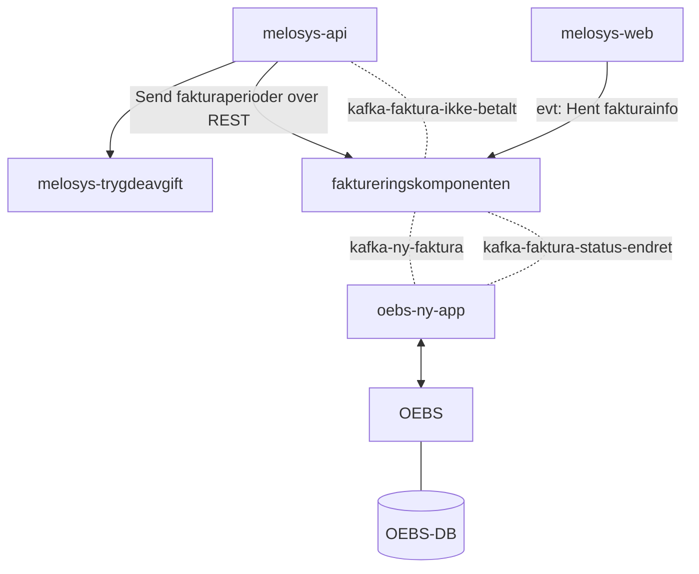

# Faktureringskomponenten




```mermaid
classDiagram
class fakturaserie {
    id INT
    vedtaksnummer VARCHAR
    opprettet_dato DATE
    beskrivelse VARCHAR 240
    start_dato DATE
    slutt_dato DATE
    intervall VARCHAR
    status VARCHAR
    (PK) PK_id
}

class faktura {
    id INT
    fakturaserie_id INT
    total_belop BIGINT
    periode_fra DATE
    periode_til DATE
    dato_sendt DATE
    status VARCHAR
    dato_betalt DATE
    (PK) id
    (FK) FK_faktura_id
    (FK) FK_status
}

class faktura_linje {
    id INT
    faktura_id
    periode_fra
    periode_til
    beskrivelse
    belop
}

class fakturaserie_status {
    <<enum>>
    OPPRETTET
    DELVIS_SENDT
    FERDIG
} 

class fakturaserie_intervall {
    <<enum>>
    MANEDLIG
    KVARTAL
}

class faktura_status {
    <<enum>>
    OPPRETTET
    SENDT
    PURRET
    BETALT
}

fakturaserie "1" -->  "1..*" faktura
fakturaserie "PK_id" --> "FK_fakturaserie_id" faktura
fakturaserie "FK_status" -- "PK_fakturaserie_status" fakturaserie_status
fakturaserie "FK_intervall" -- "PK_fakturaserie_intervall" fakturaserie_intervall
faktura "FK_status" -- "PK_fakutra_status" faktura_status
faktura "1" -->  "1..*" faktura_linje

```