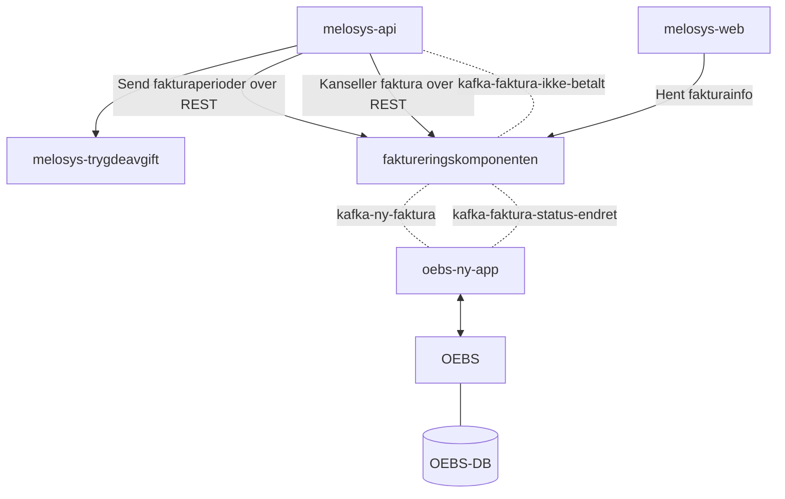
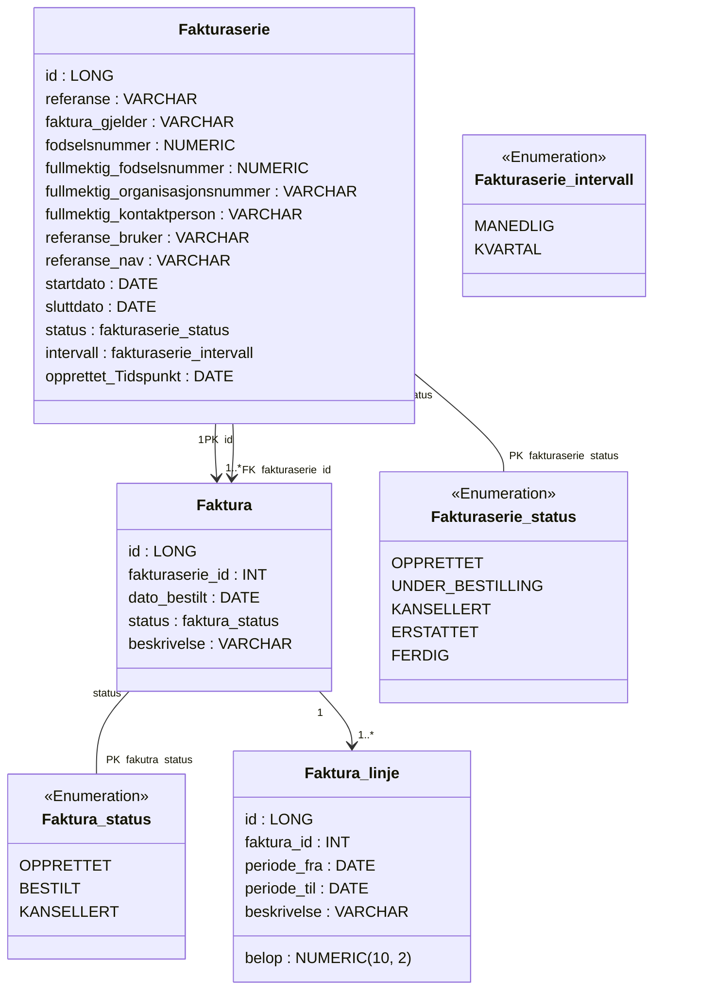

# Faktureringskomponenten

## Utvikling

### Kjør opp prosjekt lokalt

1. Via melosys-docker-compose, kjør opp `make start-all`
2. Kjør melosys-api i `local-mock` profil
3. Kjør melosys-web `npm start`
4. Kjør faktureringskomponenten i `local` profil

### Feil
#### Feilmelding: 401 UNAUTHORIZED  
##### Årsak
Feil URL (view-localhost i stedet for localhost) ble brukt i Faktureringskomponenten sine tester på Ubuntu-maskiner.  

Det er fordi VMWare Horizon Client kan ha lagt inn `127.0.0.1 view-localhost` automatisk. 
Sørg for at riktig URL brukes og at hosts-filen er korrekt konfigurert for å unngå denne feilen.


##### Løsning
Oppdater hosts-filen på Ubuntu-maskinen ved å flytte `127.0.0.1 localhost` til **øverste linje** i `/etc/hosts`-filen.   

Dette vil se slik ut:
```hosts
    127.0.0.1 localhost
    127.0.0.1 view-localhost
    127.0.1.1 <din-maskin>
```

### Gradle

Vi bruker Gradle i dette prosjektet.

> Hvert gradle prosjekt inkluderer en gradlew / gradlew.bat fil som vi kan bruke for å kjøre gradle kommandoer uten å måtte ha det installert lokalt på vår maskin. 
> Hvis du har egen gradle erstatter du `./gradlew` med `gradle`.

Build: `./gradlew build`
Clean: `./gradlew clean`
Test: `./gradlew test`
Run: `./gradlew run`

## Datastruktur

```json5
{
  "fakturaserieReferanse": "MEL-103-123",
  "fodselsnummer": "1234578911",
  "referanseBruker": "Referanse for bruker",
  "referanseNAV": "Referanse for NAV",
  "fullmektig": {
    "fodselsnummer": "1234578911",
    "orgNr": "123456789",
    "kontaktperson": "Ole Brumm"
  },
  "intervall": "KVARTAL",
  "perioder": [
    {
      "enhetsprisPerManed": 10900,
      "startDato": "01.01.2022",
      "sluttDato": "30.04.2022",
      "beskrivelse": "Inntekt: 50.000, Dekning: Pensjonsdel, Sats: 21.8 %"
    },
    {
      "enhetsprisPerManed": 3400,
      "startDato": "01.05.2022",
      "sluttDato": "31.03.2023",
      "beskrivelse": "Inntekt: 50.000, Dekning: Helsedel med rett til syke-/foreldrepenger, Sats: 6.8 %"
    }
  ]
} 
```






# Henvendelser

Spørsmål knyttet til koden eller prosjektet kan stilles som issues her på GitHub

## For NAV-ansatte

Interne henvendelser kan sendes via Slack i kanalen [#teammelosys](https://nav-it.slack.com/archives/C92481HSP).