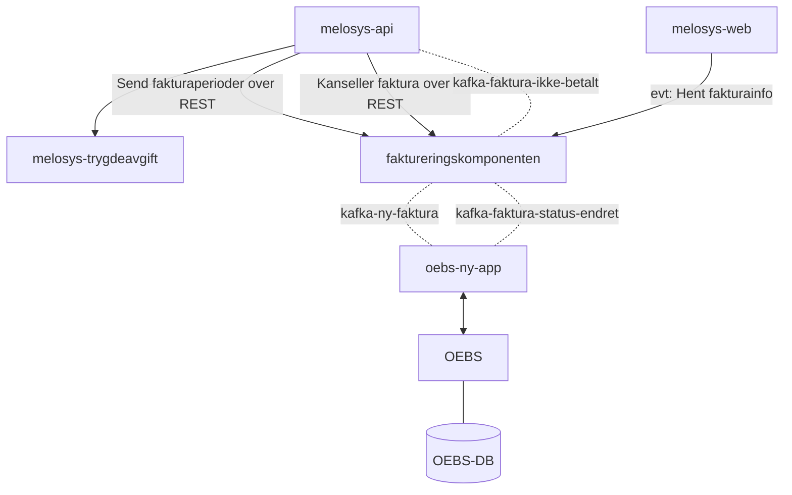

# Faktureringskomponenten
```json5
{
    "vedtaksnummer": "MEL-103-123",
    "fodselsnummer": "1234578911",
    "referanseBruker": "ASD",
    "fullmektig": {
        "orgNr": "123456789",
        "kontaktperson": "Ole Brumm"
    },
    "intervall": ["KVARTAL", "MÅNEDLIG"],
    "periode": [
        {
            "enhetspris_per_maned": 10900, // 10*10900+((16/30)*10900)
            "fra": "01.01.2022",
            "til": "30.04.2022",
            "beskrivelse": "Inntekt: 50.000, Dekning: Pensjonsdel, Sats: 21.8 %"
        },
        {
            "enhetspris_per_maned": 3400,
            "fra": "01.05.2022",
            "til": "31.03.2023",
            "beskrivelse": "Inntekt: 50.000, Dekning: Helsedel med rett til syke-/foreldrepenger, Sats: 6.8 %"
        }
    ]
} 
```

```mermaid
sequenceDiagram
    participant api as Melosys-API
    participant faktura as Faktureringskomponenten
    participant oebs as OEBS
    
    Note over api,faktura,oebs: Heiasd asd as
    api->>+faktura: Logg inn
    
    alt Credentials not found
        account->>web: Invalid credentials
    else Credentials found
        account->>-web: Successfully logged in
    end
```




```mermaid
classDiagram
class fakturaserie {
    id INT
    vedtaksnummer VARCHAR
    opprettet_dato DATE
    faktura_gjelder VARCHAR 240
    start_dato DATE
    slutt_dato DATE
    intervall VARCHAR
    status VARCHAR
    (PK) PK_id
}

class faktura {
    id INT
    fakturaserie_id INT
    total_belop BIGINT
    periode_fra DATE
    periode_til DATE
    dato_sendt DATE
    status VARCHAR
    dato_betalt DATE
    beskrivelse VARCHAR
    (PK) id
    (FK) FK_faktura_id
    (FK) FK_status
}

class faktura_linje {
    id INT
    faktura_id
    periode_fra
    periode_til
    beskrivelse
    belop
}

class fakturaserie_status {
    <<enum>>
    OPPRETTET
    UNDER_BESTILLING
    FERDIG
} 

class fakturaserie_intervall {
    <<enum>>
    MANEDLIG
    KVARTAL
}

class faktura_status {
    <<enum>>
    OPPRETTET
    BESTILT
    KANSELLERT
}

fakturaserie "1" -->  "1..*" faktura
fakturaserie "PK_id" --> "FK_fakturaserie_id" faktura
fakturaserie "FK_status" -- "PK_fakturaserie_status" fakturaserie_status
fakturaserie "FK_intervall" -- "PK_fakturaserie_intervall" fakturaserie_intervall
faktura "FK_status" -- "PK_fakutra_status" faktura_status
faktura "1" -->  "1..*" faktura_linje

```