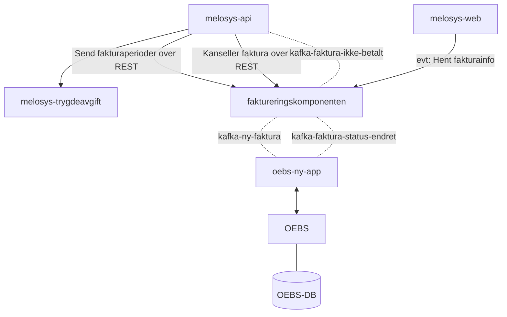

# Faktureringskomponenten
```json5
{
    "vedtaksId": "MEL-103-123",
    "fodselsnummer": "1234578911",
    "referanseBruker": "Referanse for bruker",
    "referanseNAV": "Referanse for NAV",
    "fullmektig": {
        "fodselsnummer": "1234578911",
        "orgNr": "123456789",
        "kontaktperson": "Ole Brumm"
    },
    "intervall": "KVARTAL",
    "perioder": [
        {
            "enhetsprisPerManed": 10900,
            "startDato": "01.01.2022",
            "sluttDato": "30.04.2022",
            "beskrivelse": "Inntekt: 50.000, Dekning: Pensjonsdel, Sats: 21.8 %"
        },
        {
            "enhetsprisPerManed": 3400,
            "startDato": "01.05.2022",
            "sluttDato": "31.03.2023",
            "beskrivelse": "Inntekt: 50.000, Dekning: Helsedel med rett til syke-/foreldrepenger, Sats: 6.8 %"
        }
    ]
} 
```

```mermaid
sequenceDiagram
    participant api as Melosys-API
    participant faktura as Faktureringskomponenten
    participant oebs as OEBS
    
    Note over api,faktura,oebs: Heiasd asd as
    api->>+faktura: Logg inn
    
    alt Credentials not found
        account->>web: Invalid credentials
    else Credentials found
        account->>-web: Successfully logged in
    end
```




```mermaid
classDiagram
class fakturaserie {
    id : LONG
    vedtaks_id : VARCHAR
    faktura_gjelder : VARCHAR
    fodselsnummer : NUMERIC
    fullmektig_fodselsnummer : NUMERIC
    fullmektig_organisasjonsnummer : VARCHAR
    fullmektig_kontaktperson : VARCHAR
    referanse_bruker : VARCHAR
    referanse_nav : VARCHAR
    startdato : DATE
    sluttdato : DATE
    status : fakturaserie_status
    intervall : fakturaserie_intervall
    opprettet_Tidspunkt : DATE
    (PK) id
}

class faktura {
    id : LONG
    fakturaserie_id : INT
    dato_bestilt : DATE
    status : faktura_status
    beskrivelse : VARCHAR
    (PK) id
    (FK) fakturaserie_id
}

class faktura_linje {
    id : LONG
    faktura_id : INT
    periode_fra : DATE
    periode_til : DATE
    beskrivelse : VARCHAR
    belop : NUMERIC(10, 2)
    (PK) id
    (FK) faktura_id
}

class fakturaserie_status {
    <<enum>>
    OPPRETTET
    UNDER_BESTILLING
    KANSELLERT
    FERDIG
} 

class fakturaserie_intervall {
    <<enum>>
    MANEDLIG
    KVARTAL
}

class faktura_status {
    <<enum>>
    OPPRETTET
    BESTILT
    KANSELLERT
}

fakturaserie "1" -->  "1..*" faktura
fakturaserie "PK_id" --> "FK_fakturaserie_id" faktura
fakturaserie "status" -- "PK_fakturaserie_status" fakturaserie_status
fakturaserie "intervall" -- "PK_fakturaserie_intervall" fakturaserie_intervall
faktura "status" -- "PK_fakutra_status" faktura_status
faktura "1" -->  "1..*" faktura_linje
```